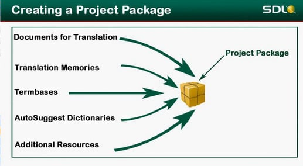
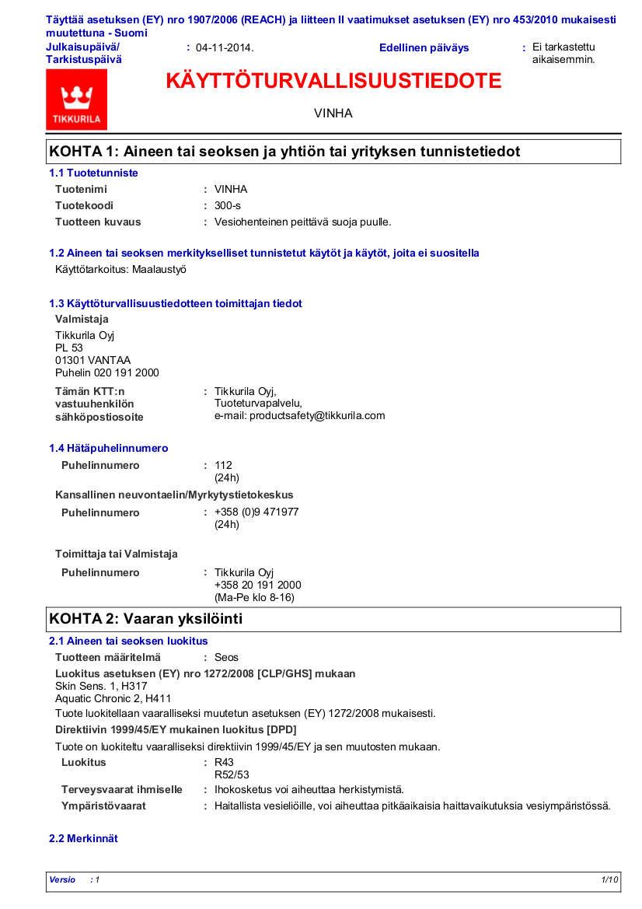
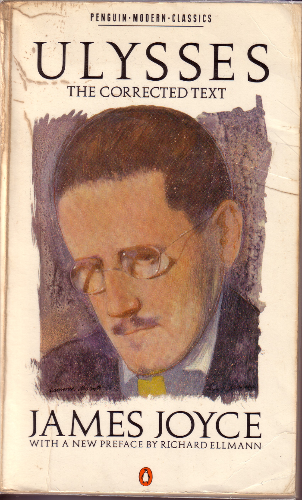

<style>
.reveal h2{
    padding-bottom: 20px;
}

p { text-align: left;
font-size: 12;

}

.reveal a:not(.image) {
text-decoration:underline;
}

.coldiv {width:47%;float:left;}
.coldiv2 {float:left;width:30%;}


.rowdiv {width:100%;clear:left;}

.reveal section img { background:none; border:none; box-shadow:none; }
</style>

## Käännösmuisteista ja käännösohjelmistoista

#### Juho Härme / 11.9.2015


--- .class &vertical

## Määritelmiä

.fragment 1. [CAT](https://en.wikipedia.org/wiki/Computer-assisted_translation) $\ne$ [MT](https://en.wikipedia.org/wiki/Machine_translation)

.fragment 2. käännösohjelma $\ne$ käännösmuisti


***

### Käännösohjelmat


.fragment Käyttöliittymiä, jotka 

.fragment <span style="color:#A00000 ;"> &nbsp;&nbsp;&nbsp;&nbsp;&nbsp;&nbsp;1.&nbsp;&nbsp;kommunikoivat käännösmuistien kanssa</span>
                                                            
.fragment <span style="color:#A00000 ;"> &nbsp;&nbsp;&nbsp;&nbsp;&nbsp;&nbsp;2.&nbsp;&nbsp;segmentoivat tekstejä käännettäviksi palasiksi </span>

.fragment <span style="color:#A00000 ;"> &nbsp;&nbsp;&nbsp;&nbsp;&nbsp;&nbsp;3.&nbsp;&nbsp;tuottavat kohdekielisen dokumentin automaattisesti muotoiltuna </span>

.fragment <span style="color:#A00000 ;"> &nbsp;&nbsp;&nbsp;&nbsp;&nbsp;&nbsp;4.&nbsp;&nbsp;pitävät huolta esim. tägien vastaavuudesta </span>

<br>

.fragment - [Trados](http://www.sdl.com/cxc/language/translation-productivity/trados-studio/), [WordFast](https://www.wordfast.net/), [MemoQ](https://www.memoq.com/get-memoq), [OmegaT](http://www.omegat.org/fi/omegat.html)...


***

### Käännösmuistit

.fragment Tietokantamuodossa (ohjelman sisäinen käyttö)

.fragment XML-tiedostoina (jako + ohjelmistoista riippumaton kommunikointi)

***

```
<?xml version="1.0" encoding="utf-8" ?>
<!DOCTYPE tmx SYSTEM "tmx14.dtd">
<tmx version="1.4">
  <header
    creationtool="LF Aligner"
    creationtoolversion="3.11"
    datatype="unknown"
    segtype="sentence"
    adminlang="FI"
    srclang="RU"
    o-tmf="TW4Win 2.0 Format"
  >
  </header>
  <body>
<tu creationdate="20150212T140830Z" creationid="jh">
<tuv xml:lang="RU"><seg>Уважаемый господин мэр,</seg></tuv>
<tuv xml:lang="FI"><seg>Arvoisa kaupunginjohtaja,</seg></tuv>
</tu>
<tu creationdate="20150212T140830Z" creationid="jh">
<tuv xml:lang="RU"><seg>Ой, как мы все любим памяти переводов!</seg></tuv>
<tuv xml:lang="FI"><seg>Voi kuinka me kaikki tykätään käännösmuisteista!</seg></tuv>
</tu>

```

--- .class &vertical

## Käyttöliittymien perusperiaatteita


.fragment - <span style='color:red;'>Aikaisemmin:</span> word-integroituja (ks. [WordFast classic](http://www.wordfast.com/products/products_wordfast))

.fragment - Nykyisin useimmat *standalone* / *studio* -mutoisia

***

### Esimerkki: MemoQ


<iframe width="853" height="480" src="https://www.youtube.com/embed/f57iYsD4yzg?start=143" frameborder="0" allowfullscreen></iframe>


---

## Palvelimella vai paikallisesti?


<div>
    <div class='fragment coldiv'>
        
    </div>
    <div class='fragment coldiv'>
        
    </div>
    <div class='fragment rowdiv'>
        
    </div>
</div>

--- .class &vertical

## Sovellettavuus ja soveltumattomuus

***



***


***



***

<br><br><br><br>
    
<span style='color:white;background-color:black;padding:10px;align:center';>työskentely-ympäristönä?</span>


--- .class


## Mistä minulle?

<ul>
<li class='fragment'> In-house-kääntäjäksi
<li class='fragment'> Freelance-version hankkiminen (Trados: 695€)
<li class='fragment'> Omat viritelmät (OmegaT, WF anywhere?) (0€)
<li class='fragment'> Väliaikainen projektikohtainen lisenssi (0€)
</ul>

---

<div style='margin:20%'>
    <span style='color:white;background-color:black';>
        Tämäkin esitys moodlessa.
    </span>
</div>

