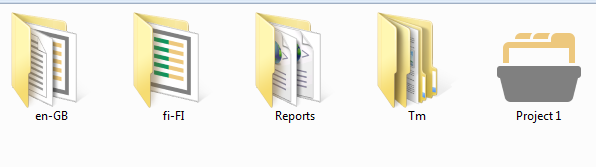
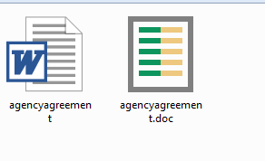
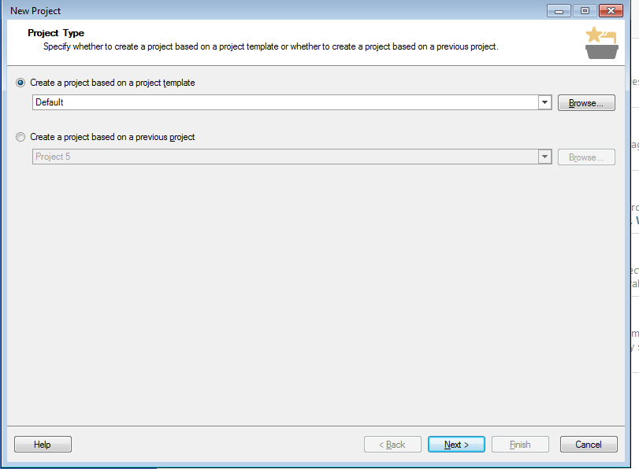
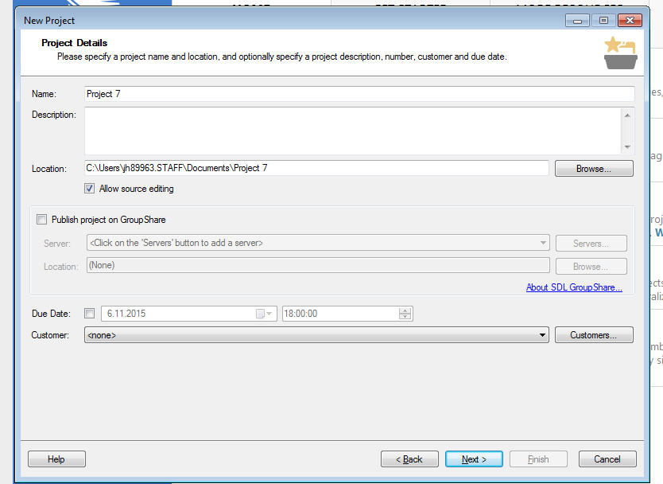

## MVKS47 Käännösteknologian harjoituskurssi 2015 - 2016

##### 09.11.2015: Word-tiedostot + johdatus projekteihin

--- 

### Kurssin aikataulu

- .minlist pe 30.10. Trados käännöstyökaluna
- .minlist ma 2.11.  Asennus + teoriaa muisteista
- .minlist pe 6.11 Käytännön harjoituksia muisteista
- .minlisthl ma 9.11. Word-tiedostot + johdatus projektiajatteluun
- .minlist pe 13.11 Projektien luominen ja käännöseditori
- .minlist ma 16.11. Muut tiedostomuodot / teoriaa
- .minlist pe 20.11 Muut tiedostomuodot / harjoituksia
- .minlist ma 23.11. Edistyneemmät editoritoiminnot
- .minlisthlr pe 27.11 Ei tuntia
- .minlist ma 30.11. Tekstien kohdistus: teoriaa
- .minlist pe 4.12 Tekstien kohdistus: käytäntöä
- .minlist ma 7.12. Termipankit: teoriaa
- .minlist pe 11.12. Termipankit: käytäntöä
- .minlist ma 14.12. Harjoituksia
- .minlist pe 18.12. Q&A

---

#### Tänään

>- Word-tiedosto (doc/docx) Tradosin oletusmuotona
>- Mistä word-tiedostot koostuvat
>- Segmentit Tradosissa
>- Dokumenttien rakenneosat
>- Mitä ovat projektit?
>- Projektien luomisen vaiheet
>- Projektien asetukset

---

#### 1. Word-tiedoston osat

>- Otsikot, otsikkotasot
>- Kappale (vs. rivinvaihto)
>- Listaelementit
>- Taulukot, kuvat
>- Muotoilut

--- .class &vertical

#### 2. Segmentointi Tradosissa

>- Kappale vs. Lause + säännöt
>- Yhdistäminen/jakaminen?

***

    'You can only merge neighbor segments in the same paragraph.'

---

### Trados ja projektit

--- .class &vertical

#### 1. Mistä Trados-projektit koostuvat?

Käännettävät tiedostot + kohdetiedostot

Käännösmuistit 
<ul>
<li class='fragment'> Käyttäjän muistit
<li class='fragment'> Projektikohtaiset muistit
</ul>

Termitietokannat

Referenssitiedostot

Raportit

Projektin asetukset

***

##### Projektikansio levyllä

.fragment 

>- Lähdekielen kansio
>- Kohdekielen kansio
>- Raportit
>- JOS projektikohtainen TM
>- Projektitiedosto

.fragment 

---

#### 2. Projekti vs. yksittäinen tiedosto

>- Joka tapauksessa teknisesti ottaen aina luodaan projekti
>- Kansiorakenne
>- Termitietokantojen yhdistäminen
>- Valmiiden pohjien käyttäminen
>- Deadlinet / vakioasiakkaat
>- Pre-translate-toiminto

--- .class &vertical

#### 3. Projektin luomisen vaiheet

1. .smaller2 Project Type
2. .smaller2 Project Details
3. .smaller2 Project Languages
4. .smaller2 Project Files
5. .smaller2 Translation memory and automated translation
6. .smaller2 Termbases
7. .smaller2 SDL Perfect Match
8. .smaller2 Project preparation
9. .smaller2 Batch processing settings
10. .smaller2 Project summary

***

##### 3.1. Project Type

>- Valitse, käytätkö mallipohjaa
>- Valitse teetkö vanhan projektin pohjalta
>- Oletus/aluksi: **next**

.fragment 

***

##### 3.2. Project Details

>- Valitse, käytätkö mallipohjaa
>- Valitse teetkö vanhan projektin pohjalta
>- Oletus/aluksi: **next**

.fragment 

