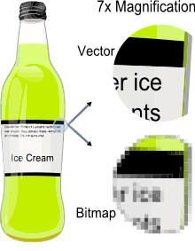
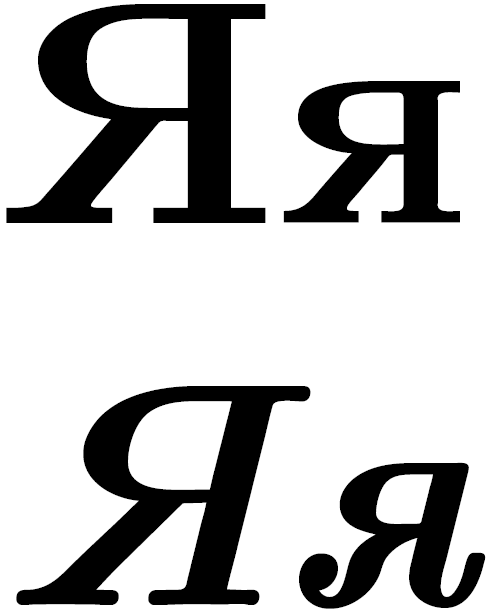

## MVKS47 Käännösteknologian harjoituskurssi 2015 - 2016

##### 16.11.2015: Muut tiedostomuodot: teoriaa

--- 

### Kurssin aikataulu

- .minlist pe 30.10. Trados käännöstyökaluna
- .minlist ma 2.11.  Asennus + teoriaa muisteista
- .minlist pe 6.11 Käytännön harjoituksia muisteista
- .minlist ma 9.11. Word-tiedostot + johdatus projektiajatteluun
- .minlist pe 13.11 Projektien luominen ja käännöseditori
- .minlisthl ma 16.11. Muut tiedostomuodot / teoriaa
- .minlist pe 20.11 Muut tiedostomuodot / harjoituksia
- .minlist ma 23.11. Edistyneemmät editoritoiminnot
- .minlisthlr pe 27.11 Ei tuntia
- .minlist ma 30.11. Tekstien kohdistus: teoriaa
- .minlist pe 4.12 Tekstien kohdistus: käytäntöä
- .minlist ma 7.12. Termipankit: teoriaa
- .minlist pe 11.12. Termipankit: käytäntöä
- .minlist ma 14.12. Harjoituksia
- .minlist pe 18.12. Q&A

---

#### Tänään

>- Projektipaketin avaaminen
>- Projektin viimeistelystä
>- pdf-pikakurssi
>- html-pikakurssi
>- muita tiedostomuotoja

---

#### Trados-käännöksen workflow

1. Luodaan projekti

2. Käännetään

3. Verifioidaan ja tarkistetaan

4. Viimeistellään

5. Toimitetaan

---

### Harjoitus

- .minlisthl Avaa Moodlesta oman B-työkielen tiedosto kohdasta "projektipaketit"
- .minlisthl Käännä tiedosto
- .minlisthl Verifioi ja viimeistele

--- .class &vertical

### PDF (portable document format)

.quotestyle "These documents could be viewed on any machine and any selected document could be printed locally. This capability would truly change the way information is managed -John Warnock, Adobe

 
 

>- .minlist [Tekstidatan sisältävät pdf-tiedostot](textual_pdf.pdf)
>- .minlist [Salatut pdf-tiedostot](nontextual.pdf)
>- .minlist [Tiedostot ilman tekstidataa](novajagaz.pdf)

***

### Vektorigrafiikka vs. rasterigrafiikka:

--- .class &vertical

### Pdf-tiedostojen käsittelyyn liittyviä kysymyksiä

.fragment 1. Tekstidatan sisältävät tiedostot

>- Trados: word-muoto ennen käännöstä
>- Tradosin konvertoija vs. ulkoinen konvertoija?
>- Konvertoidun tiedoston valmistelu?

***

>- Linux: pandoc, pdfreflow, pdftotext---
>- Windows: Adobe Reader, calibre, [pdfripper](http://www.pdfpdf.com/pdfconverter.html)
>- online-konvertoijat
>- Google Docs
>- Copypaste

--- .class &vertical

.fragment 2.  Tiedostot ilman tekstidataa

>- Ulkoinen konvertointi OCR-ohjelmiston avulla
>- Tiedoston laatu
>- valmistelu (pre-processing) kuvaohjelmalla
>- valmisteluun erikoistunut ohjelma: [ScanTailor](http://scantailor.org)

***

### OCR (optical character recognition)

>- .minlist [Tiedostot ilman tekstidataa](novajagaz.pdf)
>- Kirjain kerrallaan ympäristö huomioiden: 

***

#### OCR-ohjelmistoja

>- [Trados 2015:](http://signsandsymptomsoftranslation.com/2015/07/03/studio-2015-i/) Solid documents 
>- [Abbyy FineReader](http://www.abbyy.com/finereader/)
>- [Tesseract](http://www.paperfile.net/index.html) (FreeOCR)
>- [Tesseract](http://sourceforge.net/projects/gimagereader/) (gimagereader)
>- [FineReader Online](https://finereaderonline.com/)
>- Joskus OCR voi olla paras ratkaisu myös tekstidataa sisältäviin pdf-tiedostoihin!

--- .class &vertical

### HTML (Hypertext markup language)

>- Internet-sivujen koodaus, jota selaimet tulkitsemat
>- vrt XML = Extensible markup language
>- xml: ei ennalta määrättyjä tägejä
>- html: vain ennalta määrätyt tägit

*** 

### Tägit (tags)

    <html>

    tietokone, joka lukee tätä koodia, tietää, että
    kaikki tämä on html-kieltä

    </html>

***

>- \<  + tägin nimi + \> = tägi

    

.fragment tekstiä

    

***

### Harjoitus

>- Valitse parin kanssa mikä tahansa internetsivu
>- Paina f12 sivulla ollessasi
>- poimi niin monta eri tägiä kuin ehdit
>- listaa frekventeimmät

***

### Harjoituksen tuloksia

---

### Muita käännöksissä kohdattavia tiedostomuotoja

>- Plain text (encoding!)
>- taulukkotiedostot
>- esitykset (ppt, odp, jne)
>- tekstitykset (subrip)
>- mitä vielä?

---

### Lopuksi: Tukeeko Trados odt-tiedostoja?

>- Testitiedostoja Moodlessa

