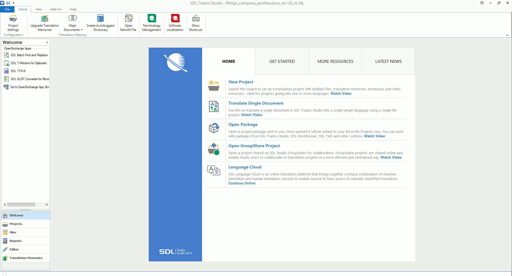

---
---

<article class='container'>
<article class='leftcontent'>

<em>Trados-opas. &copy; Juho Härme. Päivitetty </em>

Ennen kääntämistä
==================

Miten avaan yksittäisen tiedoston?
----------------------------------

**Ongelma:** *Sinulla on yksi dokumentti, jonka haluat kääntää ja saada
käännöksen tuloksena syntyvän muistin talteen/palautettavaksi toimeksiantajalle* 

1. Avaa Trados

2. Klikkaa Welcome-ruudulla 'Translate single file pair' -kohtaa

3. Kahlaa avautuvan dialogin läpi

Paketit ja projektit
--------------------

**Ongelma:** *käännöksen tuloksena syntyvän muistin talteen/palautettavaksi toimeksiantajalle* 

1. Avaa Trados

2. Klikkaa Welcome-ruudulla 'Translate single file pair' -kohtaa

3. Kahlaa avautuvan dialogin läpi

Kääntäminen
===========

**Ongelma:** *käännöksen tuloksena syntyvän muistin talteen/palautettavaksi toimeksiantajalle* 

1. Avaa Trados

2. Klikkaa Welcome-ruudulla 'Translate single file pair' -kohtaa

3. Kahlaa avautuvan dialogin läpi

Kääntämisen jälkeen
===================

**Ongelma:** *käännöksen tuloksena syntyvän muistin talteen/palautettavaksi toimeksiantajalle* 

1. Avaa Trados

2. Klikkaa Welcome-ruudulla 'Translate single file pair' -kohtaa

3. Kahlaa avautuvan dialogin läpi

</article>
</article>

<article class='rightcontent'>

</article>

