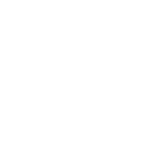

<article class='container'>
<article class='leftcontent'>

<em>Trados-opas. &copy; Juho Härme. Päivitetty </em>

Ennen kääntämistä
==================

Yksittäiset tiedostot
----------------------

*Miten alan kääntää yksittäistä tiedostoa?*

<ol>
<li> <a href='javascript:void(0);' onClick='javascript:ChangeUpper(this,"guide_images/startscreen_welcome.png")'>Valitse Welcome-ruutu vasemmasta alareunasta</a>
<li> <a href='javascript:void(0);' onClick='javascript:ChangeUpper(this,"guide_images/filepair1.gif")'>Klikkaa Welcome-ruudulla 'Translate single document'</a>
<li> Valitse tiedosto
<li> <a href='javascript:void(0);' onClick='javascript:ChangeUpper(this,"guide_images/filepair2.gif")'>Valitse lähde- ja kohdekieli</a>
<li> Valitse käytettävä käännösmuisti (Mahdollista käyttää myös useita muisteja)
<ol type='a'>
<li> <a href='javascript:void(0);' onClick='javascript:ChangeUpper(this,"guide_images/newmemory.gif")'>Lisää uusi tyhjä käännösmuisti</a>
<li> <a href='javascript:void(0);' onClick='javascript:ChangeUpper(this,"guide_images/oldmemory.gif")'>Käytä jotain olemassaolevaa muistia</a>
</ol>
</ol>

Valmiit projektipaketit
-----------------------

*Miten alan kääntää tradospakettina tullutta käännöstehtävää?*

<ol>
<li> <a href='javascript:void(0);' onClick='javascript:ChangeUpper(this,"guide_images/startscreen_welcome.png")'>Valitse Welcome-ruutu vasemmasta alareunasta</a>
<li> Klikkaa Welcome-ruudulla 'Open package'
<li> <a href='javascript:void(0);' onClick='javascript:ChangeUpper(this,"guide_images/frompackage.gif")'>Valitse tiedosto, katso paketin kuvaus,ja paina ok. </a>
</ol>

*Varsinaiseen kääntämiseen pääsee kaksoisklikkaamalla ensin projektin kansiota, sitten tiedoston nimeä.*

Projektin luominen itse
-----------------------

<ol>
<li> <a href='javascript:void(0);' onClick='javascript:ChangeUpper(this,"guide_images/startscreen_welcome.png")'>Valitse Welcome-ruutu vasemmasta alareunasta</a>
<li> <a href='javascript:void(0);' onClick='javascript:ChangeUpper(this,"guide_images/newproject.gif")'>Klikkaa Welcome-ruudulla 'New project'</a>
<li> Valitse tiedosto
<li> <a href='javascript:void(0);' onClick='javascript:ChangeUpper(this,"guide_images/setprojectname.gif")'>Siirry eteenpäin ja kirjoita projektille nimi ja kuvaus, aseta deadline</a>
<ul>
<li> Deadline (kohdassa Due date) näkyy myöhemmin projektiruudussa. Erityisen hyvä käyttää, jos useita projekteja meneillään, tällöin priorisointi helpottuu.
<li> Jos sinulla on asiakkaita, esim. tietty käännöstoimisto, jolle usein käännät, voit luoda niille valmiita profiileja *customers*-kohdassa
</ul>
<li> <a href='javascript:void(0);' onClick='javascript:ChangeUpper(this,"guide_images/chooseprojectlanguage.gif")'>Valitse lähde- ja kohdekielet</a>
<ul>
<li> Tämä kielinäyttö on vähän hämäävä ja eroaa siitä, mitä yksittäisissä tiedostoissa
<li> Hämäävyys johtuu mahdollisuudesta lisätä useitä kohdekieliä, mikä on tietysti projekteissa mahdollista 
<li> Valitse kieli/kielet vasemmasta reunasta ja paina 'Add', jolloin kieli siirtyy oikeanpuoleiseen laatikkoon ja homma on valmis
</ul>
<li> <a href='javascript:void(0);' onClick='javascript:ChangeUpper(this,"guide_images/chooseprojectfiles.gif")'>Lisää tiedosto tai tiedostoja</a>
<ul>
<li> Voit lisätä niin monta tiedostoa kuin tarve vaatii, myös kansioita
<li> Tässä kohtaa voi lisätä myös <a href='javascript:void(0);' onClick='javascript:ChangeUpper(this,"guide_images/referencemat.gif")'>referenssimateriaaleja</a>, eli vaikka aiheeseen liittyviä pdf-tiedostoja, asiakasyrityksen dokumentaatiota jne
</ul>
<li> <a href='javascript:void(0);' onClick='javascript:ChangeUpper(this,"guide_images/projmemory.gif")'>Lisää tai luo uusi käännösmuisti (tai valitse jokin oletuksena olevista)</a>
</ol>

Kääntäminen
===========

Käyttöliittymä
---------------

### Yleisnäkymä

<ul>
<li> <a href='javascript:void(0);' onClick='javascript:ChangeUpper(this,"guide_images/whole_interface_annot.png")'>Varsinainen kääntäminen tapahtuu editor-ikkunassa</a>
<li> <a href='javascript:void(0);' onClick='javascript:ChangeUpper(this,"guide_images/upper_bar.png")'>Ylhäällä office 2010-tyyliset välilehdet/valikot</a>
<ul>
<li> File
<li> Home
<li> Review
<li> Advanced
<li> View
<li> Add-Ins
<li> Help
</ul>
<li> <a href='javascript:void(0);' onClick='javascript:ChangeUpper(this,"guide_images/tm_bar.png")'>Valikkojen alla on käännösmuistin oma ikkuna</a>
<li> <a href='javascript:void(0);' onClick='javascript:ChangeUpper(this,"guide_images/termit.png")'>Käännösmuistin oikealla puolella on termipankin ikkuna</a>
<li> <a href='javascript:void(0);' onClick='javascript:ChangeUpper(this,"guide_images/translation.png")'>Itse käännöseditori on keskellä ruutua</a>
<li> <a href='javascript:void(0);' onClick='javascript:ChangeUpper(this,"guide_images/preview.png")'>Esikatselun voi asettaa esimerkiksi oikealle</a>
</ul>

Miten käännän Tradosilla?
-------------------------

Trados ja muut käännösohjelmat tarjoavat ison joukon työkaluja ja
työskentelytapoja, joiden paljouteen voi välillä hukkua. Tässä yksi esimerkki tavasta, jolla
Tradosilla voit kääntää ja siitä, millainen workflow voisi olla.

### Esimerkkimetodi 

<ol>
<li> <a href='javascript:void(0);' onClick='javascript:ChangeUpper(this,"guide_images/pretrans1.gif")'>Anna Tradosin esikääntää teksti (Pre-translate)</a>
<ul>
<li> Tämä vaihe on jo tehtynä, jos olet projektin luomisen yhteydessä sen valinnut
</ul>
<li> <a href='javascript:void(0);' onClick='javascript:ChangeUpper(this,"guide_images/translating.gif")'>Lähde kääntämään segmentti segmentiltä ylhäältä alas.</a>
<ul>
<li> Siirry seuraavaan segmenttiin *painamalla alanuolta*
</ul>
<li> Käännä loppuun asti, muista <a href='#tärkeitä-toimintoja'>*tärkeät toiminnot*</a>
<li> <a href='javascript:void(0);' onClick='javascript:ChangeUpper(this,"guide_images/empty.png")'>Nyt sinulla on raakakäännös. Siirry uudestaan alkuun</a>
<li> <a href='javascript:void(0);' onClick='javascript:ChangeUpper(this,"guide_images/empty.png")'>Lähde liikkeelle alusta ja vahvista segmentit, joihin olet tyytyväinen</a>
<ul>
<li> Tässä vaiheessa voi hioa ja muokata kaikkia niitä kohtia, jotka saa siedettävään kuntoon ilman erityisen suuria
<li> Todelliset ongelmakohdat voi vieläkin jättää vahvistamatta
</ul>
<li> <a href='javascript:void(0);' onClick='javascript:ChangeUpper(this,"guide_images/empty.png")'>Filtteröi näkyviin ainoastaan vahvistamattomat käännökset</a>
<ul>
<li> Käy näitä läpi ja hio, kunnes katsot voivasi vahvistaa
<li> Filtteröi välillä uuedstaan, niin että vahvistamattomien segmenttien määrä koko ajan vähenee
<li> **Huomaa**, *että Trados laskee sinulle tilastot siitä, kuinka monta on vahvistamatta, kuinka monta vahvistettu jne.*
</ul>
</ol>

Tärkeitä toimintoja
-------------------

### Konkordanssihaku

#### Käyttötarkoitus

Konkordanssihaulla voit hakea yksittäistä tai useampaa sanaa 

* Käännösmuisteista
* Käännettävistä tiedostoista

*Konkordanssihaku on tärkeä esimerkiksi silloin, kun käännösmuistissa ei ole tarpeeksi 
hyvin vastaavaa lähdesegmenttiä, että Trados ehdottaisi sitä automaattisesti käännökseksi
(voit itse asettaa rajan, kuinka tarkka täsmäys lähdesegmentin pitää olla). Voit kuitenkin 
avainsanojen avulla etsiä konteksteja, joista olisi apua.
*

Konkordanssit toimivat usein myös termipankin korvikkeena: vaikket olisi luonut 
varsinaista termipankkia, voit tutkia termin käännöksiä mustista konkordanssihaulla

#### Miten teen konkordanssihaun?

<ol type="a">
<li> (Hitaampi tapa)
<ol>
<li> <a href='javascript:void(0);' onClick='javascript:ChangeUpper(this,"guide_images/gohome.gif")'>Siirry valikkopalkissa home-välilehdelle</a>
<li> <a href='javascript:void(0);' onClick='javascript:ChangeUpper(this,"guide_images/pressconc.gif")'>Paina concordance search -nappia</a>
<li> <a href='javascript:void(0);' onClick='javascript:ChangeUpper(this,"guide_images/writeconc.gif")'>Kirjoita hakutermi ja paina enter</a>
</ol>

<li> (Nopeampi tapa)
<ol>
<li> <a href='javascript:void(0);' onClick='javascript:ChangeUpper(this,"guide_images/paintword.gif")'>Maalaa sana, jota haluat etsiä</a>
<li> <a href='javascript:void(0);' onClick='javascript:ChangeUpper(this,"guide_images/pressf3.gif")'>Paina F3-näppäintä</a>
</ol>

</ol>

### Käännösmuistin muokkaaminen

Projektiin liitetyn käännösmuistin muokkaaminen voi olla tarpeen esimerkiksi, kun

* Haluat muuttaa aikaisemmin tekemääsi käännöstä, jonka olet jo vahvistanut
* Et ole tyytyväinen muistissa olevaan käännökseen, ja haluat korvata sen paremmalla

jatkoa tulossa...

### Tagien (/tägien) syöttäminen

tulossa...

### Lähdesegmentin kopioiminen

tulossa..

Projektin asetusten muuttaminen kääntämisen aikana
--------------------------------------------------

asldkas

Kääntämisen jälkeen
===================

Dokumentin viimeistely (Finalize)
---------------------------------

### Mahdollisia virheviestejä

Valmiin tiedoston tiedostomuotoja
---------------------------------

Muistin säilöminen
------------------

Termejä
========

## Match

Osuma käännösmuistista. Käyttäjä voi määritellä asiakirjakohtaisesti, mikä lasketaan osumaksi, ts. kuinka 
lähellä muistista löytyvän lähdekielisen yksikön on oltava käännettävästä asiakirjasta löytyvää.
Yleensä tämä luku (joka ilmaistaan prosentteina) on erittäin korkea.

### Fuzzy match (CM)

Muu kuin 100% osuma. Tämäkin on määriteltävissä. Segmentti käännösmuistissa, jossa on paljon samaa kuin
jossakin käännettävän asiakirjan segmentissä.

### 100% match (CM)

Osuma, joka on täysin sama muistissa ja käännettävässä asiakirjassa. Vrt. kuitenkin Context match

### Context match (CM)

Osuma joka on

* sama käännösmuistissa ja käännettävässä asiakirjassa ja 
* jossa myös edeltävät segmentit (konteksti) vastaavat

## Repetition

Huom. laskutus!

Lähteitä ja lisää lukemista
===========================

[http://www.transinfopreneur.com/what-is-the-difference-between-repetitions-100-matches-and-context-matches-in-sdl-trados-studio-2014/](http://www.transinfopreneur.com/what-is-the-difference-between-repetitions-100-matches-and-context-matches-in-sdl-trados-studio-2014/)

Wordfast Anywhere -harjoitus
============================

## Tehtävä 1: Käännä ilman muistia harjoitustiedosto Agency_COntract_sh.docx

<ol>
<li> Lataa koneellesi Moodlesta  ensimmäinen 18.9. -harjoituskerran tiedostoista
<ul><li>(Suora likki [tässä](https://learning2.uta.fi/pluginfile.php/378636/mod_folder/content/0/Agency_Contract_sh.docx?forcedownload=1))</ul>
<li> Mene osoitteesen [http://www.freetm.com](http://www.freetm.com)
<li> Luo käyttäjätili  <a href='javascript:void(0);' onClick='javascript:ChangeUpper(this,"guide_images/account_wf.png")'>painamalla 'Create a new account'-linkkiä'</a> (vaatii vain sähköpostin ja salasanan)
<li> <a href='javascript:void(0);' onClick='javascript:ChangeUpper(this,"guide_images/wf_upload.gif")'>Lataa palvelimelle moodlesta saatu tiedosto</a>
<ul><li>Eli klikkaa vasemmasta yläkulmasta *file-->Upload Document file*</ul>
<li> <a href='javascript:void(0);' onClick='javascript:ChangeUpper(this,"guide_images/removemt.gif")'>Poista käytöstä konekääntäjä</a>
<ul><li>Klikkaa ylhäältä oikealta *Tools--Open Setup dialog box*
<li>Klikkaa *Setup machine translation*
<li>Poista ruksi kohdasta *Use Word Lingo*
<li>Paina OK
<li>Paina Save Settings
</ul>
<li>  <a href='javascript:void(0);' onClick='javascript:ChangeUpper(this,"guide_images/startwf.gif")'>Ala kääntää dokumenttia ylhäältä alas</a>
<ul>
<li> Eli klikkaa *Edit--open next segment* tai näppäile *ALT+alanuoli*
<li>HUOM! Käännöslaadulla ei ole tässä harjoituksessa **mitään väliä**. Voit vaikka kirjoittaa siansaksaa tai aslkdjalkdas-näpyttelyä, mutta suosittelen kuitenkin edes sinne päin olevia sanoja, jotta harjoitus olisi mielekäs
<li> Voit esimerkiksi näpytellä  pari sanaa segmentin alusta ja siirtyä eteenpäin
</ul>
<li><a href='javascript:void(0);' onClick='javascript:ChangeUpper(this,"guide_images/finnishwf.gif")'>Käännä loppuun ja paina auvautuvaan dialogiin 'close'</a>
</ol>

## Tehtävä 2: Avaa harjoitustiedosto agencyagreement.doc ja tutki, miten äsken luotu muisti toimii

<ol>
<li> Lataa koneellesi Moodlesta  toinen (alempi) 18.9. -harjoituskerran tiedostoista
<ul><li>(Suora likki [tässä](https://learning2.uta.fi/pluginfile.php/378636/mod_folder/content/0/agencyagreement.doc?forcedownload=1))</ul>
<li> <a href='javascript:void(0);' onClick='javascript:ChangeUpper(this,"guide_images/wf_upload.gif")'>Lataa moodlesta saatu toinen tiedosto palvelimelle</a>
<ul><li>Eli klikkaa vasemmasta yläkulmasta *file-->Upload Document file*</ul>
<li>  <a href='javascript:void(0);' onClick='javascript:ChangeUpper(this,"guide_images/startwf.gif")'>Ala kääntää dokumenttia ylhäältä alas, riittää kun kirjoitat pari merkkiä ja siirryt eteenpäin</a>
<ul>
<li> Eli klikkaa *Edit--open next segment* tai näppäile *ALT+alanuoli*
<li> Katso, minkälaisten segmenttien kohdalla käännösmuisti löytää vastaavuuksia:
<ul><li>Mitä muisti näyttää <a href='javascript:void(0);' onClick='javascript:ChangeUpper(this,"guide_images/wf_percent.png")'>vastaavuusprosentiksi?</a>
<li> **Pohdi, miten tietokone toimii ja mikä sen mielestä on vastaavaa, mikä ei.**
</ul>
</ul>
<li><a href='javascript:void(0);' onClick='javascript:ChangeUpper(this,"guide_images/downloadtm.gif")'>Lataa tuottamasi käännösmuisti</a>
<ol>
<li> Paina vasemmasta yläkulmasta *File*
<li> Valitse ensimmäinen kohta: TMs and Glossaries
<li> Liu'uta hiiri vasemmalla olevan varsinaisen käännösmuistin päälle ja valitse se klikkaamalla siitä (mistä vain muualta paitsi valintaruudusta)
<li> Muistin tausta muuttuu harmaasta siniseksi
<li> Klikkaa pientä Download-nappulaa muistin yläpuolella
<li> Vaihda formaatiksi Standard TMX format
<li> Klikkaa Download
<li> Paina OK (anna valinnan olla oletuksessa eli 'Download')
</ol>
<li> **Palauta muisti Moodlen korvaavien tehtävien kansioon ennen ensi kertaa** 
<ul><li>[suora linkki tässä](https://learning2.uta.fi/mod/assign/view.php?id=310955)</ul>
</ol>

</article>
</article>

<article class='rightcontent'>

</article>

